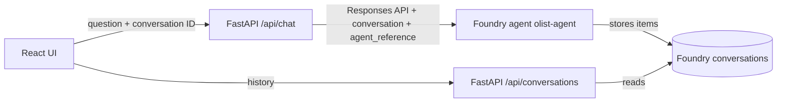

# Talk to the Olist data

A React + TypeScript chat UI and a thin FastAPI backend that routes every question to a
**Microsoft Foundry agent** (`olist-agent`). The agent owns the instructions, tools and
data access; this app handles the conversation UI, configuration and safe error handling.

## Run locally

Requires Python 3.11–3.13, [uv](https://docs.astral.sh/uv/), Node.js 22+, the
[Azure CLI](https://learn.microsoft.com/cli/azure/install-azure-cli), and the **Azure AI User**
role on the Foundry project.

1. Copy `.env.example` to `.env` and set `FOUNDRY_PROJECT_ENDPOINT` and `FOUNDRY_AGENT_NAME`
   (optionally `FOUNDRY_AGENT_VERSION`; unset means the latest version).
2. Sign in so the backend can get a Microsoft Entra token: `az login`.
3. From the repository root, start the backend:

   ```powershell
   uv sync --frozen --extra dev
   uv run python -m app
   ```

4. In another terminal, start the UI:

   ```powershell
   cd frontend
   npm ci
   npm run dev
   ```

5. Open **http://127.0.0.1:5173**. API health: **http://127.0.0.1:8000/api/health**.
   API docs: `/api/docs`.

For a single process, run `npm run build` in `frontend`, then start the backend and open
**http://127.0.0.1:8000**. `docker compose up --build` runs the same app on localhost:8000;
a container has no `az login`, so give it a service principal through `AZURE_TENANT_ID`,
`AZURE_CLIENT_ID` and `AZURE_CLIENT_SECRET` in `.env`, or a managed identity in Azure.

## Design



- The backend uses the official [`azure-ai-projects`](https://pypi.org/project/azure-ai-projects/)
  SDK: `AIProjectClient.get_openai_client()` and `responses.create(...)` with an
  `agent_reference`, as in the
  [Foundry quickstart](https://learn.microsoft.com/azure/foundry/quickstarts/get-started-code).
- Authentication is Microsoft Entra ID through `DefaultAzureCredential`. Foundry agents do not
  accept API keys, so no secret is stored in the repository or sent to the browser.
- Chat history lives only in **Foundry conversations**; neither the app nor the browser stores
  it. The first question creates a conversation tagged with the caller's ID, the agent name and
  a title (`metadata.user_id`, `agent`, `title`); each turn is sent with `conversation=<id>`,
  so Foundry supplies the context and appends the question, tool calls and answer. The browser
  keeps only the open conversation's ID, in the URL (`?c=conv_…`), so reloads and links work.
- History endpoints: `GET /api/conversations` (the caller's conversations with this agent,
  newest first), `GET /api/conversations/{id}` (user and assistant messages, tool items
  omitted) and `DELETE /api/conversations/{id}`. A conversation owned by another user or
  agent answers 404, exactly like a missing one. Foundry's project-wide conversation list has
  no owner filter (and is not in the SDK or REST reference), so the backend pages through it
  (up to 1,000 conversations) and filters on metadata; a large multi-user deployment would
  need a per-user index instead.
- Answers are rendered as Markdown without raw HTML. A table with a numeric column also gets
  a bar chart (shown first, with a Chart/Table toggle and a measure picker when there are
  several numeric columns).
- The version-16-based agent draft includes Code Interpreter for PNG charts and aggregate
  CSV exports. The app translates its file citations into conversation-protected previews
  and downloads, including when history is reopened. Files may expire; downloads are capped
  at 10 MB. See [the editable agent configuration](microsoft_foundry/README.md) for instructions,
  local YAML checks, and applying the draft in Foundry.
- The UI is React 19 + Tailwind CSS v4 (CSS-first `@theme`, no config file) with semantic
  OKLCH color tokens defined once through `light-dark()`. It follows the OS theme; the toggle
  pins light or dark (`public/theme.js` applies it before first paint, as an external file
  because the CSP blocks inline scripts). Inter is self-hosted for the same reason.
- Conversation UX: suggested questions, a stop button (or Esc) while waiting, an elapsed-time
  indicator, copy on answers, in-place retry on errors or stops, a conversation history in the
  sidebar (open, refresh, delete), and a `role="log"` conversation region for screen readers.
  There is no regenerate: it would store a second copy of the question in Foundry.
- Foundry errors map to short messages (429 rate limit, 503 authentication, 504 timeout,
  502 other) with a request ID. Questions are never echoed in validation errors or logs.
- Caller protection: a streaming request byte limit, a 4,000-character question limit, a
  concurrency gate that answers 429 when busy, and ACA
  built-in authentication in production (`APP_ENV=production` refuses to start without it).
  See [docs/cloud.md](docs/cloud.md).
- Warehouse safety now depends on the agent's tools and database identity. What must be
  verified per agent version is in [docs/agent-safety.md](docs/agent-safety.md).
- The previous SQL table, chart and query-inspection view was removed on purpose; answers
  come from the agent as Markdown.

## Validation

```powershell
uv run pytest
uv run ruff check backend
uv run python scripts/sync_foundry_agent.py
cd frontend
npm test           # unit tests (Vitest): number parsing, chart detection, history pairing
npm run build
npm run test:e2e   # needs the built app running on port 8000 (or BASE_URL) and Microsoft Edge
```

`backend/tests/test_foundry.py` checks the exact requests sent to Foundry (URL, Entra token
scope, conversation metadata, `conversation` + `agent_reference` body, owner checks, list
paging and item filtering) against a mocked transport. Browser tests use API fixtures,
so they do not call Foundry.

Live checks (use the `PG*` and Foundry settings in `.env`; the evaluation uses model quota):

```powershell
uv run --extra warehouse python scripts/verify_warehouse.py   # counts, grain, keys, totals
uv run --extra warehouse python scripts/inspect_category_keys.py
uv run --extra warehouse python scripts/evaluate_agent.py     # agent safety and accuracy
```

Scripts read only `olist_olap_abd` in read-only transactions and append every query to
`logs/db_operations.md`.

## Project map

- `backend/app/`: settings, Foundry client and API.
- `frontend/src/`: conversation UI (`components/`), Markdown answers and table charts (`table.ts`).
- `knime/`, `sql/`, `scripts/`, `pipeline/`, `dataset/`, `linkedService/`, `factory/`: the
  warehouse ETL (KNIME and Azure Data Factory) that loads `olist_olap_abd`.
- `scripts/`: read-only warehouse checks and the live agent evaluation.
- `sql/04_agent_reader_role.sql`: least-privilege role for the agent's database identity.
- `docs/cloud.md`, `docs/agent-safety.md`: deployment and agent safety requirements;
  `docs/archive/`: the previous backend's decisions, cloud guide and verification record.
- `docs/decisions.md`: decision log.
